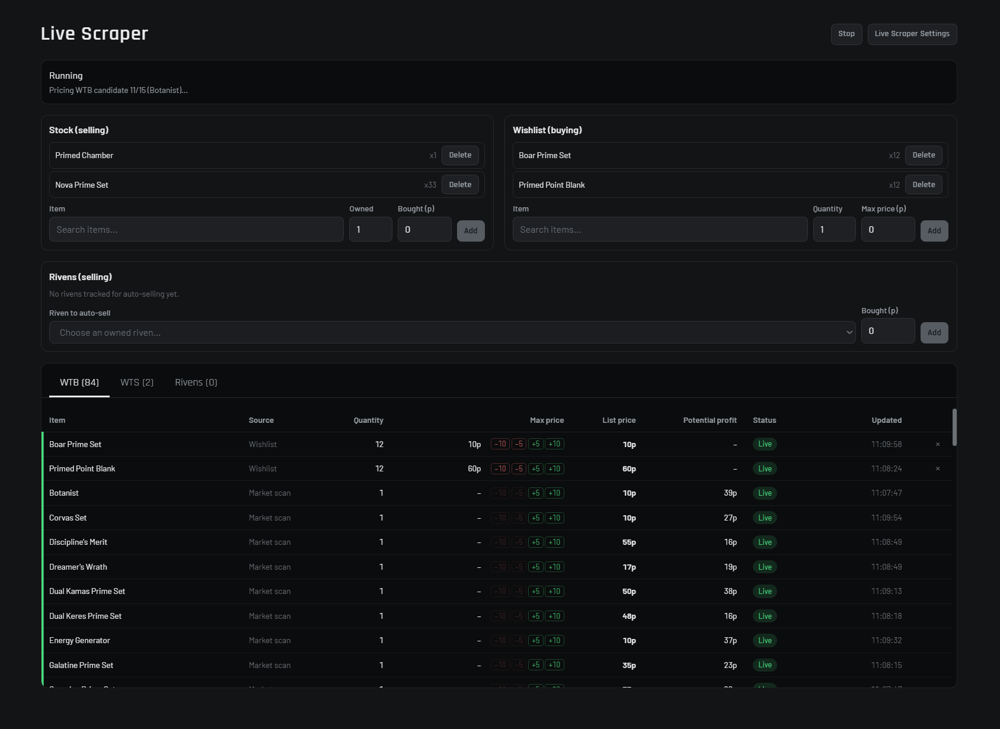
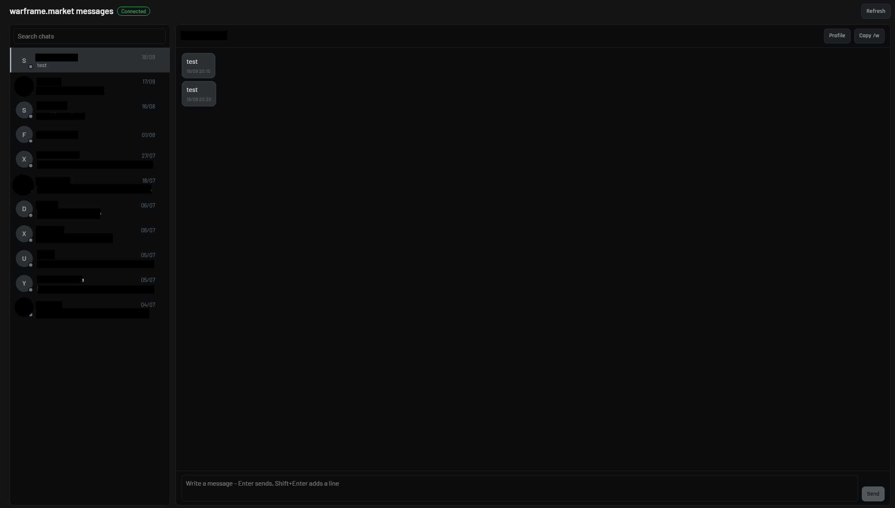

# PlatHelper

PlatHelper is a fork of [WFHelper](https://github.com/WFHelper/WFHelper), the
unofficial Warframe companion app (inventory, foundry, relic and riven scanning,
warframe.market orders). Everything WFHelper does is still here - see
[wfhelper.com](https://wfhelper.com) for the full feature tour and FAQ.

This guide only covers what PlatHelper adds on top: an automated
warframe.market trader, a messages tab and a few comfort features. The trading
logic is modelled on [Quantframe](https://github.com/Kenya-DK/quantframe-react).

PlatHelper keeps its own data folder. On first start it copies an existing
WFHelper profile, so your login and settings carry over.

> **Heads-up:** the Live Scraper creates, changes and deletes **real** orders and
> auctions on your warframe.market account. Start with small budgets and watch
> the first runs.

## Live Scraper



Open **Live Scraper** in the sidebar. You must be signed in to warframe.market
(Market tab). Press **Start**; the status box shows what the engine is doing.
**Settings** holds all thresholds.

The engine can run three jobs at once (Settings > General > *Active trade modes*):

| Mode | What it does |
| --- | --- |
| **Buy** | Scans the whole warframe.market catalog for items that can be bought low and resold, and places buy orders (WTB) for the best ones. |
| **Sell** | Keeps sell orders (WTS) for your stock priced against the competition. |
| **Wishlist** | Places buy orders for specific items you want, up to your maximum price. |

### How to configure your scraper

Under *Settings > Items > Buying (WTB)*. `-1` switches a filter off.

| Setting | Meaning |
| --- | --- |
| **Minimum volume** | Only items that trade at least this often per day. Higher = items that actually sell. |
| **Minimum profit** | Minimum expected platinum between buy and resale price. |
| **Maximum trading tax** | Skips items whose in-game trade costs more credits than this. |
| **Maximum average price** | Ignores items whose average price is above this - keeps expensive items out. |
| **Maximum total buy budget** | Upper limit for the platinum bound in all buy orders together. The engine picks the most profitable set that fits. |
| **Buy quantity** | How many pieces each buy order asks for. |

For selling, set *Minimum profit* under *Selling (WTS)*.: a sell
order never goes below your buy price plus this value.

### Listings

The panel at the bottom lists everything the engine handles, in three tabs:
**WTB**, **WTS** and **Rivens**, with a status per row.

- Click a price, or use the `-10 -5 +5 +10` buttons, to set a price limit for
  that row (maximum price when buying, minimum price when selling).
- **Right-click** a row for everything else: edit values, pause/resume, open the
  item on warframe.market, price statistics, copy name, remove.
- Removing a row also deletes its order on warframe.market.

### Selling your stock

Add an item under *Stock (selling)* with the price you paid. With **Sell** active, the
engine lists it and keeps the price competitive. Sell orders you already have on
warframe.market are picked up automatically (marked **WFM**) and re-priced the
same way; orders you placed by hand are never deleted by the clean-up on start.

### Rivens

Add one of your rivens under *Rivens (selling)*. The engine searches auctions with the
same stats - offline sellers included - and lists yours at the average of the
cheapest few.

- *Settings > Rivens > Sample size* is how many of the cheapest auctions are
  averaged. Set it to `1` to follow the cheapest one.
- The row's minimum price is a floor, never a target.

## Messages



The **Messages** tab is your warframe.market inbox: chat list with unread
counts, live incoming messages, reply, and delete a chat (this also removes it on
warframe.market). The sidebar shows the unread total. New messages ring the
notification sound from *Settings*; turn on *WFM DM notifications* there for a
desktop toast as well.

## Comfort features

- **Zoom:** `Ctrl` + mouse wheel, or `Ctrl` `+` / `-` / `0`, scales the whole app.
- **Sidebar:** drag a row to reorder it; a line shows where it lands. Drop a row
  on the middle of another to create a group, double-click a group name to
  rename it. **Customize** saves sidebar layouts as presets.
- **Mouse back/forward buttons** switch between the views you visited.

## Install / build

Build the Windows installer yourself:

```bash
pnpm install
pnpm run dist:win
```

The installer ends up in `release/`. PlatHelper installs next to WFHelper; you
can remove the old app afterwards.

## Credits and license

PlatHelper is built on WFHelper by the WFHelper team and stays under the same
[MIT license](LICENSE). Inventory data comes from
[warframe-api-helper](https://github.com/Sainan/warframe-api-helper). PlatHelper
is not affiliated with Digital Extremes or warframe.market.
